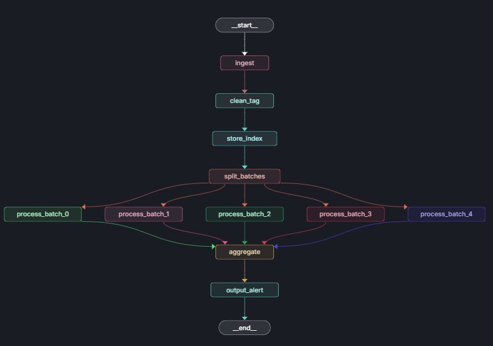

# AI Demand Forecasting System

An intelligent demand forecasting platform that combines LangGraph-based AI agents with machine learning models to predict product demand, optimize supply chains, and provide actionable business insights.

## What is this?

This project is a comprehensive **AI Demand Forecasting System** designed for businesses to predict product demand with high accuracy. The system features:



### Core Capabilities

- **Data Integration & Cleansing**: Automatically pulls and cleans data from multiple sources, preparing it for analysis in minutes instead of days
- **Pattern Recognition**: Uses AI to identify complex patterns in historical data, including subtle trends that human analysts might miss
- **Real-time Adjustments**: Continuously monitors market conditions and adjusts forecasts dynamically
- **Scenario Planning**: Rapidly generates and analyzes multiple demand scenarios to help businesses prepare for various market conditions

### Key Features

1. **Seasonal Demand Prediction**: Analyzes years of historical data to predict seasonal fluctuations with remarkable accuracy, factoring in weather patterns, economic indicators, and social trends
2. **New Product Forecasting**: Predicts demand for new products by analyzing data from similar product launches, market conditions, and consumer sentiment
3. **Promotional Impact Analysis**: Quickly assesses the impact of promotions on demand and predicts how different promotional strategies might affect future demand
4. **Supply Chain Optimization**: Accurately predicts demand to optimize inventory levels, suggest optimal reorder points and quantities, reducing both stockouts and excess inventory
5. **Competitor Analysis**: Monitors competitor actions and predicts their impact on demand, including pricing changes, new product launches, and marketing campaigns

### Technology Stack

- **Backend**: FastAPI (Python) with LangGraph for AI agent orchestration
- **Frontend**: React with Recharts for data visualization
- **AI/ML**: Hybrid approach using LLMs (GPT-4) for reasoning and Prophet/ARIMA for time series forecasting
- **Data**: Mock data generators for proof of concept (extensible to real data sources)

## How to Install and Run It

### Prerequisites

- Python 3.11 or higher
- Node.js 18+ and npm
- OpenAI API key (for LLM features)

### Installation Steps

#### 1. Clone the Repository

```bash
git clone <repository-url>
cd workspace
```

#### 2. Set Up Backend

```bash
# Install Python dependencies
cd backend
pip install -r requirements.txt

# Install the agent package
pip install -e ..

# Create .env file with your API keys
cp ../.env.example .env
# Edit .env and add: OPENAI_API_KEY=your_key_here
```

#### 3. Set Up Frontend

```bash
# Install Node.js dependencies
cd ../frontend
npm install
```

### Running the Application

#### Start LangGraph for development

```bash
langgraph dev
```

You can see the UI Studio at LangSmith or local at http://127.0.0.1:2024

#### Start the Backend Server

```bash
cd backend
uvicorn app.main:app --reload --port 8000
```

The API will be available at `http://localhost:8000`

#### Start the Frontend Development Server

In a new terminal:

```bash
cd frontend
npm run dev
```

The dashboard will be available at `http://localhost:3000`

### Quick Start (Both Services)

You can run both services simultaneously:

**Terminal 1 (Backend):**
```bash
conda activate LangGraph
cd backend
uvicorn app.main:app --reload --port 8000
```

**Terminal 2 (Frontend):**
```bash
conda activate LangGraph
cd frontend
npm run dev
```

**Terminal 3 (Celery):**
```bash
conda activate LangGraph
cd backend 
celery -A app.celery_app worker --loglevel=info --pool=solo
```

**Terminal 4 (LangGraph):**
```bash
conda activate LangGraph
langgraph dev
```

```bash
https://smith.langchain.com/studio/?baseUrl=http://127.0.0.1:2024
http://localhost:3000/
http://localhost:8000/docs#/jobs
http://localhost:5050/browser/
admin123
```

### Using the Dashboard

1. Open `http://localhost:3000` in your browser
2. The dashboard will automatically load data for **Denso EV Inverter**
3. Use the filters to:
   - Select different products (when available)
   - Adjust date ranges
   - Change forecast modes (comprehensive/seasonal/promotional/new_product)
   - Set forecast horizon (7-90 days)
4. View three main sections:
   - **Main Overview**: Historical sales, forecast visualization, key metrics
   - **Forecast Analysis**: Seasonal forecasts, scenario comparisons, anomaly detection
   - **Supply Chain**: Inventory metrics, cost analysis, reorder recommendations

## How to Contribute to the Project

We welcome contributions! Here's how you can help improve the AI Demand Forecasting System.

### Getting Started with Contributions

1. **Fork the Repository**: Create your own fork of the project
2. **Create a Branch**: Make a new branch for your feature or bug fix
   ```bash
   git checkout -b feature/your-feature-name
   ```
3. **Make Changes**: Implement your changes following the project structure
4. **Test Your Changes**: Ensure all tests pass and the application runs correctly
5. **Commit**: Write clear commit messages
   ```bash
   git commit -m "Add: Description of your changes"
   ```
6. **Push and Create Pull Request**: Push your branch and create a PR

